<p align="center">
  
</p>

<h1 align="center">Hassam Saeed · UI/UX Designer &amp; AI Product Designer</h1>

<p align="center">
  <b>Figma expert designing web apps, SaaS dashboards, mobile apps and design systems with Claude × Figma MCP.</b><br/>
  Based in Rawalpindi, Pakistan · Available for freelance and remote work worldwide
</p>

<p align="center">
  <a href="https://github.com/hasssam-github">
    
  </a>
</p>

<p align="center">
  <a href="./assets/Hassam_Saeed_CV.pdf"></a>
  <a href="https://www.fiverr.com/hassamsaeed99"></a>
  <a href="https://www.upwork.com/freelancers/~017ed4923bf93b9a28"></a>
</p>

<p align="center">
  <a href="https://www.linkedin.com/in/hassamsaeed04"></a>
  <a href="https://dribbble.com/UIOVIA"></a>
  <a href="https://www.behance.net/hassamsaeed04"></a>
  <a href="https://www.instagram.com/hassam.uiux99/"></a>
  <a href="https://www.pinterest.com/hassamsaeed04/"></a>
  <a href="mailto:hassamsaeed04@gmail.com"></a>
</p>

---

## ✦ About me

I'm a **UI/UX Designer with 4+ years of experience** designing web and mobile products. I work with an **AI-augmented, agentic design workflow**: I pair expert Figma craft with **Claude, Cursor and the Model Context Protocol (MCP)** to move from research to prototypes and developer-ready code faster.

Right now I design **Conduitly's web app** remotely for a US-based team, end to end, from research and wireframes to high-fidelity prototypes and handoff.

```yaml
role:      UI/UX Designer · AI-Augmented Product Design
focus:     Web apps · Mobile apps · Design systems · Branding
workflow:  Research → Figma → Claude × Figma MCP → code-ready specs
based_in:  Rawalpindi, Pakistan · remote, hybrid or on-site
status:    Open to freelance projects and remote roles
```

## 🤖 My AI × design workflow

<table>
  <tr>
    <td align="center" width="25%"><b>1 · Research</b><br/><sub>User interviews, usability analysis and AI-assisted synthesis</sub></td>
    <td align="center" width="25%"><b>2 · Design in Figma</b><br/><sub>Wireframes, design systems and high-fidelity UI</sub></td>
    <td align="center" width="25%"><b>3 · Claude × Figma MCP</b><br/><sub>Turning components and tokens into production-style UI</sub></td>
    <td align="center" width="25%"><b>4 · Handoff</b><br/><sub>Code-ready specs that shorten the design-to-dev loop</sub></td>
  </tr>
</table>

<p align="center">
  
  
  
  
  
</p>

<p align="center">
  
</p>

<p align="center"><sub>Also: Figma AI · Claude Design · Midjourney · Canva</sub></p>

## 🛠️ Services

| What I design | What you get |
|---|---|
| **Landing pages & websites** | Conversion-focused UI for startups, SaaS and agencies |
| **SaaS & web app UI** | Dashboards, complex flows and admin panels built on a design system |
| **Mobile app UI/UX** | iOS and Android screens, onboarding, paywalls and prototypes |
| **Design systems** | Figma components, variables and tokens ready for developers |
| **AI product UX** | Chatbots, agent workflows and AI-native interfaces |
| **Figma to code** | Code-ready specs and UI via Claude × Figma MCP and Cursor |

## 🎨 Selected work

<table>
  <tr>
    <td width="33%" valign="top">
      <a href="https://dribbble.com/shots/26791178-AI-Workflow-Builder-Automation-Flow-UI"></a>
      <p align="center"><b>AI Workflow Builder</b><br/><sub>Automation flow UI</sub></p>
    </td>
    <td width="33%" valign="top">
      <a href="https://dribbble.com/shots/26747337-AI-Chatbot-UI-Design"></a>
      <p align="center"><b>AI Chatbot</b><br/><sub>Conversational product UI</sub></p>
    </td>
    <td width="33%" valign="top">
      <a href="https://dribbble.com/shots/26941937-SaaS-Integrations-Platform-Web-UI-Design"></a>
      <p align="center"><b>SaaS Integrations Platform</b><br/><sub>Web app UI</sub></p>
    </td>
  </tr>
  <tr>
    <td width="33%" valign="top">
      <a href="https://dribbble.com/shots/27008948-Y-Combinator-Landing-Page-Startup-Web-UI"></a>
      <p align="center"><b>Startup Landing Page</b><br/><sub>Marketing web UI</sub></p>
    </td>
    <td width="33%" valign="top">
      <a href="https://dribbble.com/shots/26813726-AI-Powered-Landing-Page-Digital-Branding-Agency"></a>
      <p align="center"><b>AI-Powered Agency Site</b><br/><sub>Digital branding landing page</sub></p>
    </td>
    <td width="33%" valign="top">
      <a href="https://dribbble.com/shots/26603937-Doctor-Appointment-App-UI"></a>
      <p align="center"><b>Doctor Appointment App</b><br/><sub>Mobile app UI</sub></p>
    </td>
  </tr>
</table>

<p align="center">
  <a href="https://dribbble.com/UIOVIA"></a>
  <a href="https://www.behance.net/hassamsaeed04"></a>
</p>

## 💼 Experience

| Role | Company | When |
|---|---|---|
| **UI/UX Designer** | Conduitly, USA · Remote | Nov 2024 – Present |
| **UI/UX Designer** | HashtagHK, Pakistan | Mar 2024 – Jun 2024 |
| **UI/UX Designer** | IsloAI × Gamican, Pakistan | Jan 2023 – Feb 2024 |
| **Android Developer & UI/UX Designer** | FHA Technology, Pakistan | Jul 2022 – Dec 2023 |

<sub>🎓 Bachelor of Information Technology, Arid Agriculture University, Rawalpindi</sub>

## 🚀 Currently

- 🔭 Designing Conduitly's web app with a Claude × Figma MCP workflow
- 📱 Building **SoulChord**, a personal iOS app I own as product owner and designer
- 💬 Happy to talk about AI-native UX, design systems and agentic workflows

## 🤝 Work with me

Need a landing page, a SaaS dashboard, a mobile app or a design system? I take on freelance projects on **[Fiverr](https://www.fiverr.com/hassamsaeed99)** and **[Upwork](https://www.upwork.com/freelancers/~017ed4923bf93b9a28)**, or email me at **[hassamsaeed04@gmail.com](mailto:hassamsaeed04@gmail.com)**.

<p align="center">
  
</p>
